# WhatsAppBotReminder - Project Documentation

## 📋 Project Overview

WhatsApp Bot dengan fitur **Reminder**, **Templates**, **Games**, **Fun**, **Utility**, dan **Digest** menggunakan library `whatsapp-web.js` dan database `Supabase`.

| Info | Detail |
|------|--------|
| **Version** | 2.0.0 |
| **Runtime** | Node.js |
| **Database** | Supabase (PostgreSQL) |
| **Library** | whatsapp-web.js, node-cron, dayjs |
| **Entry Point** | `index.js` |

---

## 🏗️ Project Structure

```
WhatsAppBotReminder/
├── index.js                 # Main entry point (510 lines)
├── package.json             # Dependencies & scripts
├── .env                     # Environment variables
├── .wwebjs_auth/            # WhatsApp session storage
├── migrations/              # SQL migration scripts
│   ├── 001_add_new_fields.sql
│   ├── 002_games_and_digest.sql
│   └── 003_fun_and_utility.sql
└── src/
    ├── commands/            # Command handlers (15 files)
    │   ├── index.js         # Export all commands
    │   ├── help.js          # !help
    │   ├── addReminder.js   # !addreminder
    │   ├── remindOnce.js    # !remindonce
    │   ├── listReminders.js # !listreminders
    │   ├── editReminder.js  # !editreminder
    │   ├── deleteReminder.js# !deletereminder
    │   ├── pauseReminder.js # !pausereminder, !resumereminder
    │   ├── templates.js     # !savetemplate, !usetemplate, !listtemplates
    │   ├── stats.js         # !stats
    │   ├── tagAll.js        # !tagall
    │   ├── games.js         # !tebak, !trivia, !jawab, !spin, !leaderboard
    │   ├── fun.js           # !gacha, !profile, !birthday
    │   ├── utility.js       # !splitbill, !rules, !countdown, !note
    │   └── digest.js        # !mentions, !digest
    ├── services/            # Core services (3 files)
    │   ├── database.js      # Supabase operations (42 functions)
    │   ├── scheduler.js     # Cron job management (7 functions)
    │   └── gameState.js     # In-memory game state (9 functions)
    └── utils/               # Utilities (3 files)
        ├── clientManager.js # WhatsApp client singleton (14 methods)
        ├── helpers.js       # Date/time utilities (8 functions)
        └── rateLimiter.js   # Rate limiting class
```

---

## 🛠️ Tech Stack & Infrastructure

### Dependencies

| Package | Version | Purpose |
|---------|---------|---------|
| `whatsapp-web.js` | github fork | WhatsApp Web automation |
| `@supabase/supabase-js` | ^2.39.0 | Database client |
| `node-cron` | ^3.0.3 | Task scheduling |
| `dayjs` | ^1.11.10 | Date manipulation |
| `qrcode-terminal` | ^0.12.0 | QR code for auth |
| `dotenv` | ^16.3.1 | Environment variables |

### Database Schema (Supabase)

```mermaid
erDiagram
    reminders {
        int id PK
        text chat_id
        text message
        text time
        int[] days
        boolean active
        boolean paused
        boolean is_one_time
        timestamptz target_date
    }
    templates {
        int id PK
        text chat_id
        text name UK
        text message
        text created_by
    }
    leaderboard {
        int id PK
        text chat_id
        text player_id UK
        text player_name
        int total_points
        int games_won
    }
    mentions {
        int id PK
        text chat_id
        text mentioned_user
        text sender_id
        boolean is_read
    }
    chat_activity {
        int id PK
        text chat_id
        text sender_id
        text message_type
        boolean has_media
        int hour
    }
    gacha_history {
        int id PK
        text chat_id
        text player_id
        text item_name
        text item_rarity
        int points_earned
    }
    birthdays {
        int id PK
        text chat_id
        text player_id UK
        int birth_day
        int birth_month
    }
    group_rules {
        int id PK
        text chat_id UK
        text content
    }
    countdowns {
        int id PK
        text chat_id
        text name
        timestamptz target_date
    }
    notes {
        int id PK
        text chat_id
        text name UK
        text content
    }
    sessions {
        text id PK
        text status
    }
```



---

## ⚡ Core Services

### 1. Database Service (`database.js`)

42 fungsi untuk operasi Supabase:

| Category | Functions |
|----------|-----------|
| **Session** | `saveSession` |
| **Reminders** | `getActiveReminders`, `getChatReminders`, `getReminderById`, `createReminder`, `updateReminder`, `deleteReminder`, `isReminderActive` |
| **Templates** | `saveTemplate`, `getTemplate`, `getTemplates`, `deleteTemplate` |
| **Statistics** | `getReminderStats` |
| **Games** | `updateLeaderboard`, `getLeaderboard` |
| **Mentions** | `saveMention`, `getUnreadMentions`, `markMentionsRead` |
| **Digest** | `trackChatMessage`, `getChatDigest` |
| **Gacha** | `checkGachaCooldown`, `saveGachaResult` |
| **Profile** | `getUserStats`, `setBirthday`, `getTodayBirthdays`, `getAllBirthdays` |
| **Utility** | `getGroupRules`, `setGroupRules`, `deleteGroupRules`, `getActiveCountdowns`, `createCountdown`, `getNotes`, `getNote`, `saveNote`, `deleteNote` |

### 2. Scheduler Service (`scheduler.js`)

| Function | Description |
|----------|-------------|
| `scheduleReminder` | Schedule recurring reminder dengan cron |
| `scheduleOneTimeReminder` | Schedule one-time reminder dengan setTimeout |
| `sendReminder` | Kirim reminder message ke chat |
| `stopReminder` | Hentikan scheduled reminder |
| `rescheduleReminder` | Update jadwal reminder |
| `loadAllReminders` | Load semua active reminders saat startup |
| `getActiveJobsCount` | Get jumlah active cron jobs |

### 3. Game State Service (`gameState.js`)

| Function | Description |
|----------|-------------|
| `startTebakAngka` | Mulai game tebak angka (1-100) |
| `guessTebakAngka` | Process guess dengan hint lebih besar/kecil |
| `startTrivia` | Mulai trivia quiz dari 20 pertanyaan |
| `answerTrivia` | Cek jawaban trivia dengan partial match |
| `getActiveTrivia` | Get trivia aktif untuk chat |
| `endTrivia` | Akhiri trivia game |
| `spin` | Random picker dari list |
| `isGameActive` | Cek apakah game sedang aktif |
| `getGameInfo` | Get info game aktif |

### 4. Client Manager (`clientManager.js`)

Singleton class untuk safe WhatsApp client management:

| Method | Description |
|--------|-------------|
| `setClient` | Set WhatsApp client instance |
| `setReady` | Mark client ready/not ready |
| `isClientReady` | Check client status |
| `waitForReady` | Wait for client dengan timeout |
| `safeSendMessage` | Send message dengan retry logic |
| `safeReply` | Reply dengan retry logic |
| `isRecoverableError` | Check Puppeteer context errors |
| `safeGetChat` | Get chat dengan retry |
| `healthCheck` | Health check pada client |

---

## 🎮 Feature Summary (28+ Commands)

### 📌 Reminder Commands

| Command | Description |
|---------|-------------|
| `!addreminder [hari] [jam] [pesan]` | Buat reminder recurring |
| `!remindonce [tanggal] [jam] [pesan]` | Buat one-time reminder |
| `!listreminders` | Lihat semua reminder aktif |
| `!editreminder [id] [field] [value]` | Edit reminder |
| `!deletereminder [id]` | Hapus reminder |
| `!pausereminder [id]` | Pause reminder sementara |
| `!resumereminder [id]` | Resume reminder |

### 📝 Template Commands

| Command | Description |
|---------|-------------|
| `!savetemplate [nama] [pesan]` | Simpan template pesan |
| `!usetemplate [nama]` | Gunakan template |
| `!listtemplates` | Lihat semua template |
| `!deletetemplate [nama]` | Hapus template |

### 🎮 Game Commands

| Command | Description | Points |
|---------|-------------|--------|
| `!tebak` | Game tebak angka 1-100 | +10 |
| `!trivia` | Quiz dengan 20 pertanyaan | +15 |
| `!jawab [jawaban]` | Jawab trivia | - |
| `!spin [a, b, c]` | Random picker | - |
| `!leaderboard` | Lihat ranking game | - |

### 🎉 Fun Commands

| Command | Description |
|---------|-------------|
| `!gacha` | Daily gacha roll (Common 60%, Uncommon 25%, Rare 12%, Legendary 3%) |
| `!profile` | Lihat profil & achievement |
| `!birthday set DD-MM` | Set tanggal lahir |
| `!birthday list` | Lihat daftar ulang tahun |

### 🔧 Utility Commands

| Command | Description |
|---------|-------------|
| `!splitbill [jumlah]` | Bagi tagihan ke member |
| `!rules` / `!rules set [isi]` | Lihat/set aturan grup |
| `!countdown [YYYY-MM-DD] [nama]` | Countdown ke event |
| `!note save [nama] [isi]` | Simpan catatan |
| `!note [nama]` | Lihat catatan |

### 📊 Digest Commands

| Command | Description |
|---------|-------------|
| `!mentions` | Lihat mention yang terlewat |
| `!digest` | Summary chat 24 jam terakhir |

### 📢 Other Commands

| Command | Description |
|---------|-------------|
| `!tagall` | Mention semua member grup |
| `!stats` | Statistik reminder |
| `!help` | Daftar semua command |
| `!debug` | Debug info |

---

## 🔒 Security & Reliability Features

1. **Rate Limiting** - 3 detik cooldown per user
2. **Admin Check** - Command hanya untuk admin grup (dapat di-bypass via env)
3. **Safe Messaging** - Retry logic untuk handle Puppeteer context errors
4. **Health Check** - Auto restart jika client tidak healthy
5. **Auto Reconnect** - Reconnect otomatis saat disconnect
6. **Row Level Security** - Enabled pada semua tabel Supabase

---

## 🚀 Running the Bot

```bash
# Install dependencies
npm install

# Development mode
npm run dev

# Production mode
npm start
```

### Environment Variables (.env)

```env
SUPABASE_URL=your_supabase_url
SUPABASE_KEY=your_supabase_anon_key
BYPASS_ADMIN_CHECK=true  # Optional: skip admin check
```

---

## 📊 Statistics

| Metric | Count |
|--------|-------|
| Total Commands | 28+ |
| Database Tables | 11 |
| Service Functions | 58+ |
| Total Line of Code | ~3,500+ |
